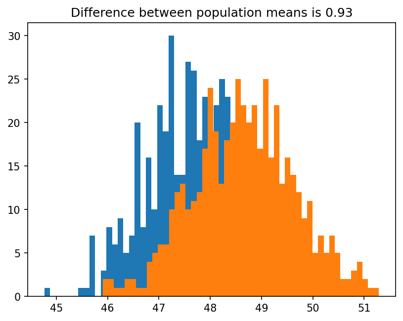

# Population synthesis as sceneario generation

# 1. Installation

```
pip install synthpop
```

# 2. Documentation

You can view the docs here.

# 3. Basic Example

Imagine we have a simulation composed of `N` agents, who are characterized by their age and sex. In this trivial example, we want to construct distributions that generate attributes to the agents, such that the mean between male and female agents' ages differs by one. We assume that the population is half male and half female.

The first thing we need to specify is a model. In general, this would involve a more extensive calculation, but in this case it will just return the ages of the male and female agents.

```python
import numpy as np

def model(generator):
    n_agents = 1000
    agent_ages, agent_sexes = generator(n_agents)
    males = []
    females = []
    for age, sex in zip(agent_ages, agent_sexes):
        if sex == 0:
            males.append(age)
        else:
            females.append(age)
    return [np.array(males), np.array(females)]
```

as you can see the model should be set up such that it takes a `generator` object that generates the agent's population, while returning a list of model outputs. Next we define a loss function that captures the distance from the simulated scenario to our desired one. In this case we will just take the difference in means to one.

```python
def loss(x):
    age_males, age_females = x
    return np.abs(1 - np.abs(np.mean(age_males) - np.mean(age_females)))
```

As we mentioned before, the `model` expects a generator object. The generator is a multivariate distribution that generates agent's attributes. We are not interested in just one distribution that can generate the sceneario of interest, but multiple ones. To this end we define a `MetaGenerator`, which generates generators.

```python
import torch
def meta_generator(params):
    mu_male, mu_female = params
    def generator(n_agents):
        sex_dist = torch.distributions.Categorical(torch.tensor([0.5, 0.5]))
        sexes = sex_dist.sample((n_agents,))
        mus = torch.tensor([mu_male, mu_female])
        mus = mus[sexes]
        age_dist = torch.distributions.Normal(mus, 1.0)
        ages = torch.clamp(age_dist.sample((n_agents,)), min=0.0)
        return ages, sexes
    return generator
```

As we can see, the `meta_generator` takes a vector of parameters `params` that paremtrize the generator which generates the attributes of the agents.

We can now start with the inference process. The only component we are missing is a prior distribution, which we will take uniform,

```python
prior = torch.distributions.Uniform(torch.tensor([10, 10]), torch.tensor([90., 90]))
```

The inference process is handled by the `Infer` class,

```python
from synthpop.infer import Infer
infer = Infer(model=model, meta_generator=meta_generator, prior=prior, loss=loss)
```

and then we can choose the method we would like to the inference, in this case `SMCABC`. Note that we can pass `num_workers > 1` if we want to sample in parallel.

```python
from synthpop.infer import SMCABC
infer_method = SMCABC(num_particles = 100, num_initial_pop=5_000, num_simulations=10_000, epsilon_decay=1.0)
trained_meta_generator = infer.fit(infer_method, num_workers=-1)
```

We can now check our results by sampling generators from our `trained_meta_generator`:

```python
generator = trained_meta_generator()
ages_males, ages_females = model(generator)

f, ax = plt.subplots()
ax.hist(ages_males.numpy(), bins=50, label)
ax.hist(ages_females.numpy(), bins=50);
print(torch.abs(ages_males.mean() - ages_females.mean()))
```

()